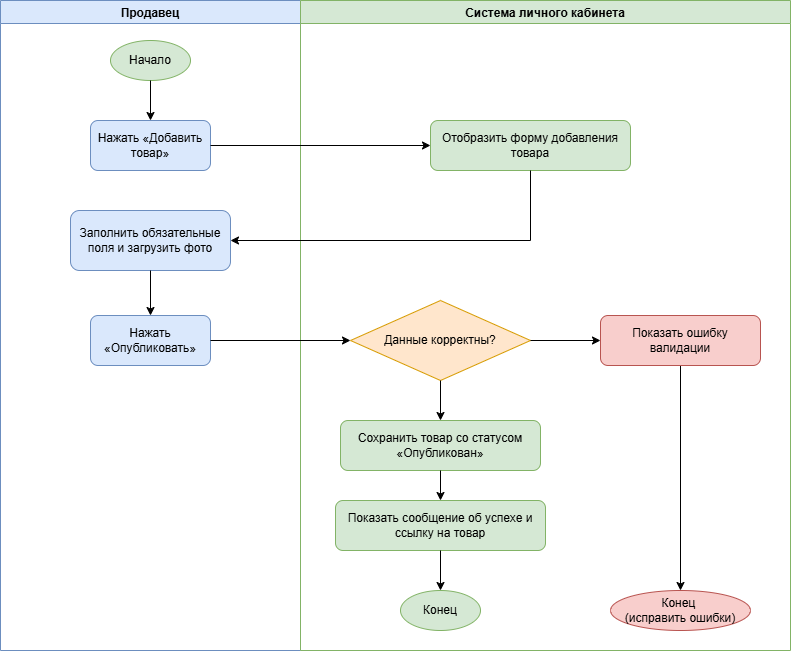

# Публикация товара на витрине маркетплейса

> [Скачать в Excel](User_Story_and_Use_Cases.xlsx)

## User Story

Как **продавец** личного кабинета,  
я хочу **опубликовать свой товар на витрине маркетплейса**,  
чтобы **покупатели могли его найти и приобрести, что увеличит мои продажи**.

## Варианты использования (Use Cases)

### UC-01: Успешная публикация товара

**Актор:** Продавец (авторизованный пользователь личного кабинета).  
**Предусловие:** Продавец вошёл в личный кабинет.  
**Основной поток:**
1. Продавец нажимает «Добавить товар».
2. Система отображает форму с полями: название, описание, цена, категория, количество, фотографии.
3. Продавец заполняет все обязательные поля и загружает хотя бы одну фотографию.
4. Продавец нажимает «Опубликовать».
5. Система проверяет корректность данных:
   - название не пустое и не длиннее 200 символов,
   - цена положительная,
   - категория выбрана из списка,
   - фото соответствует требованиям (формат, размер).
6. Система сохраняет товар в БД со статусом «Опубликован».
7. Товар появляется на витрине маркетплейса.
8. Система показывает продавцу сообщение об успешной публикации и ссылку на товар.

**Постусловие:** Товар доступен для поиска и покупки.

### UC-02: Попытка публикации с незаполненными обязательными полями

**Актор:** Продавец.  
**Предусловие:** Продавец на форме добавления товара.  
**Основной поток:**
1. Продавец нажимает «Опубликовать», не заполнив название или цену.
2. Система проверяет обязательные поля.
3. Система возвращает сообщение об ошибке: «Заполните обязательные поля: Название, Цена».
4. Поля, в которых ошибка, подсвечиваются красным.

**Постусловие:** Товар не создан, продавец может исправить ошибки.

### UC-03: Загрузка фотографии недопустимого формата

**Актор:** Продавец.  
**Основной поток:**
1. Продавец загружает фотографию в формате TIFF.
2. При попытке публикации система проверяет формат и размер.
3. Система возвращает сообщение: «Фотография должна быть в формате JPG или PNG и размером не более 5 МБ».

### UC-04: Публикация без загрузки фото

**Актор:** Продавец.  
**Основной поток:**
1. Продавец не прикрепляет фото и нажимает «Опубликовать».
2. Система проверяет наличие хотя бы одного фото (обязательное условие).
3. Система возвращает ошибку: «Добавьте хотя бы одну фотографию товара».

### UC-05: Сохранение товара как черновик

**Актор:** Продавец.  
**Предусловие:** Продавец находится на форме добавления или редактирования товара.  
**Основной поток:**
1. Продавец заполняет часть полей (например, название, цена) или все поля, но не нажимает «Опубликовать».
2. Продавец нажимает «Сохранить как черновик».
3. Система сохраняет товар в БД со статусом «Черновик», не выполняя обязательных проверок (кроме проверки формата данных, например, цена не должна быть отрицательной).
4. Система показывает сообщение «Товар сохранён как черновик» и перенаправляет в список товаров.

**Постусловие:** Товар появляется в списке товаров продавца со статусом «Черновик». Продавец может позже редактировать его и опубликовать.

### UC-06: Редактирование черновика товара

**Актор:** Продавец.  
**Предусловие:** Продавец авторизован. Ранее он создал черновик товара (UC-05).  
**Основной поток:**
1. Продавец переходит в раздел «Мои товары» (UC-07).
2. Система отображает список товаров со статусами.
3. Продавец нажимает на черновик нужного товара.
4. Система открывает форму редактирования, заполненную ранее сохранёнными данными.
5. Продавец изменяет нужные поля (цену, описание, заменяет фото).
6. Продавец может:
   - нажать «Сохранить как черновик» - изменения сохраняются, товар остаётся черновиком;
   - нажать «Опубликовать» - система выполняет проверки из UC-01 и публикует товар.
7. Система сохраняет изменения и обновляет статус товара.

**Постусловие:** Товар либо остаётся черновиком, либо публикуется на витрине.

### UC-07: Просмотр списка своих товаров

**Актор:** Продавец.  
**Предусловие:** Продавец авторизован.  
**Основной поток:**
1. Продавец нажимает на пункт меню «Мои товары».
2. Система отображает таблицу со всеми товарами продавца: название, цена, статус (Опубликован / Черновик / Отклонён), количество, дата создания.
3. Продавец может:
   - фильтровать по статусу (выпадающий список),
   - сортировать по цене, дате, названию,
   - переходить по страницам (пагинация).
4. При клике на товар продавец переходит на страницу редактирования товара (UC-06 для черновиков) или просмотра карточки (для опубликованных).
5. Продавец может создать новый товар (кнопка «Добавить товар») - переход к UC-01.

**Постусловие:** Продавец видит актуальный список своих товаров с возможностью управления.